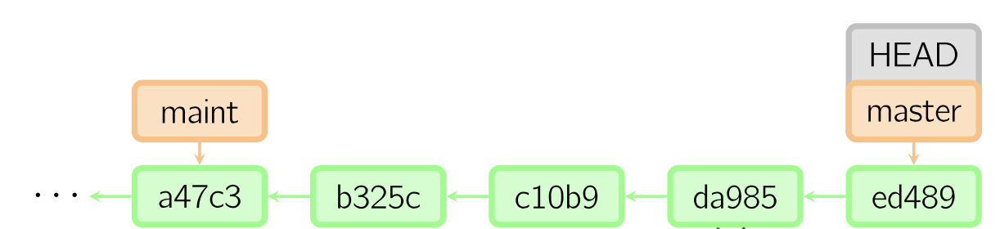
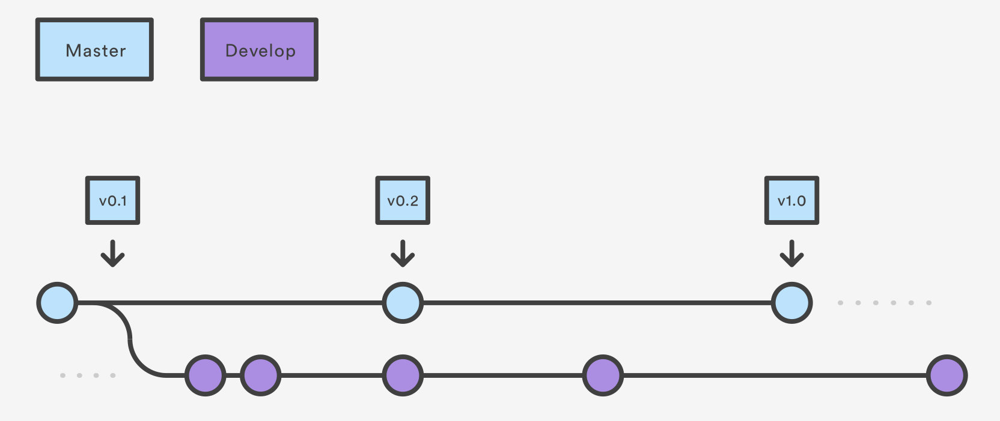
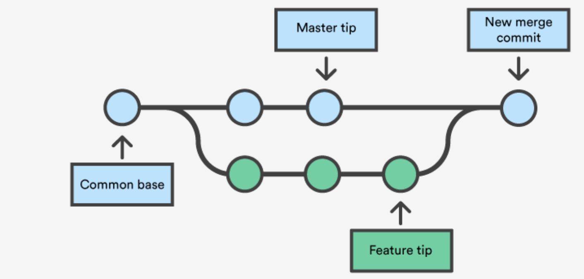

```{r setup, include=FALSE}
options(htmltools.dir.version = FALSE)


```

# Vue d'ensemble

### 1. Installer git et créer un compte Github
### 2. Qu'est-ce que git ?
### 3. Comment git fonctionne ?
### 4. Qu'est-ce que github ?
### 5. Exemple d'utilisation de git et github

inspiré de http://product.hubspot.com/blog/git-and-github-tutorial-for-beginners

---
class: inverse, center, middle
# Installer git et créer un compte Github

---
# Installer git

### Linux (Debian)
Command: `sudo apt-get install git`

### Mac
https://git-scm.com/download/mac

### Windows
https://git-scm.com/download/win


---
# Créer un compte Github


- https://github.com
- gratuit pour les repositories publiques


---
# Demander un compte éducation


- https://education.github.com/


---
# Qu'est-ce que le contrôle de version

</br>
### système qui garde la trace de tous les changements
### permet le développement collaboratif
### permet de savoir qui a fait les changements et quand
### **permet d'annuler n'importe quel changement et de retourner à un état antérieur**


---
class: inverse, center, middle
# Qu'est-ce que git ?

---
# git
</br>
.left-column[
### contrôle de version distribué
### garde tout le code et son historique sur les machines locales
### 2005 par Linus Torvald

]
.right-column[

]

---
#git 

### git n'est pas le seul outil de contrôle de version


---
class: inverse, center, middle
# Comment git fonctionne ?

---
# Snapshots

</br>
### historique du code
### enregistre les fichiers à un moment donné
### l'utilisateur décide quand faire un snapshot et de quels fichiers
### l'utilisateur peut retourner à n'importe quel snapshot


---
# Commit
</br>
### action de créer un snapshot
### projet = succession de commits
### 3 types d'information:
- changements dans les fichier depuis le dernier commit

- reference au précédent commit ("parent commit")

- hashcode name
  - 6cd1b971df0f58f57853ca1338a678c7b50bf37e

---
# Repositories ("repo")
</br>
### collection de tous les fichiers et leur historique
### machine locale ou serveur distant (GitHub par exemple)
### **cloning**: copier une repository depuis un serveur distant
### **pulling**: télécharger les commits qui n'existent pas sur la machine locale depuis un serveur distant
### **pushing**: envoyer ses propres commits locaux vers le serveur distant

---
# Branches
</br>
### tous les commits appartiennent à une branche
### il peut y avoir plusieurs branches
### la branche principale est la branche  **master**

---
# A quoi ressemble un projet ?
</br></br>


### **HEAD**: référence au plus récent commit
### **MASTER**: branche principale du projet

---
# créer une branche à partir de la branche principale
### le début d'une branche correspond à un commit spécifique
### avant de faire des changements, on crée une branche



---
# fusionner les branches
### **MERGE**: fusionner les changements d'une branche dans une autre


---
class: inverse, center, middle
# Qu'est-ce que Github ?

---
# Github

### hébergeur de repositories (le plus connu)
### permet la collaboration avec n'importe qui en ligne
### offres quelques fonctionalités supplémentaires (UI, doc, bug tracking, pull requests,...)

---
class: inverse, center, middle
# Un exemple d'utilisation

---
# créer un repository local

## créer un nouveau dossier
```{bash, eval = F}
cd ~/Desktop
mkdir monprojet
cd monprojet
```

## initialiser le repo
```{bash, eval = F}
* git init

Initialized empty Git repository in /Users/antoine/Desktop/monproject/.git/
```

---
# ajouter un fichier 

## créer un nouveau fichier 
```{bash, eval = F}
touch fichier.txt
```

## observer le statut du repo
```{bash, eval = F}
*git status

On branch master

Initial commit

Untracked files:
  (use "git add <file>..." to include in what will be committed)

	fichier.txt

nothing added to commit but untracked files present (use "git add" to track)
```

---
# Ajouter un fichier

## git add
```{bash, eval = F} 
*git add fichier.txt

*git status

Initial commit

Changes to be committed:
  (use "git rm --cached <file>..." to unstage)

	new file:   fichier.txt

```

---
# créer un commit

## git commit

```{bash, eval = F} 
*git commit -m "mon premier commit"

[master (root-commit) b345d9a] mon premier commit
 1 file changed, 1 insertion(+)
 create mode 100644 fichier.txt
```

---
# créer une nouvelle branche

## voir les branches

```{bash, eval = F} 
*git branch
master
```

## créer la branche
```
git checkout -b ma-nouvelle-branche
git branch
`* ma-nouvelle-branche`
   master
```

---
# fusionner des branches 

## git merge

```{bash, eval = F} 
git checkout master 
*git merge ma-nouvelle-branche
```

